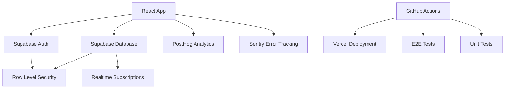
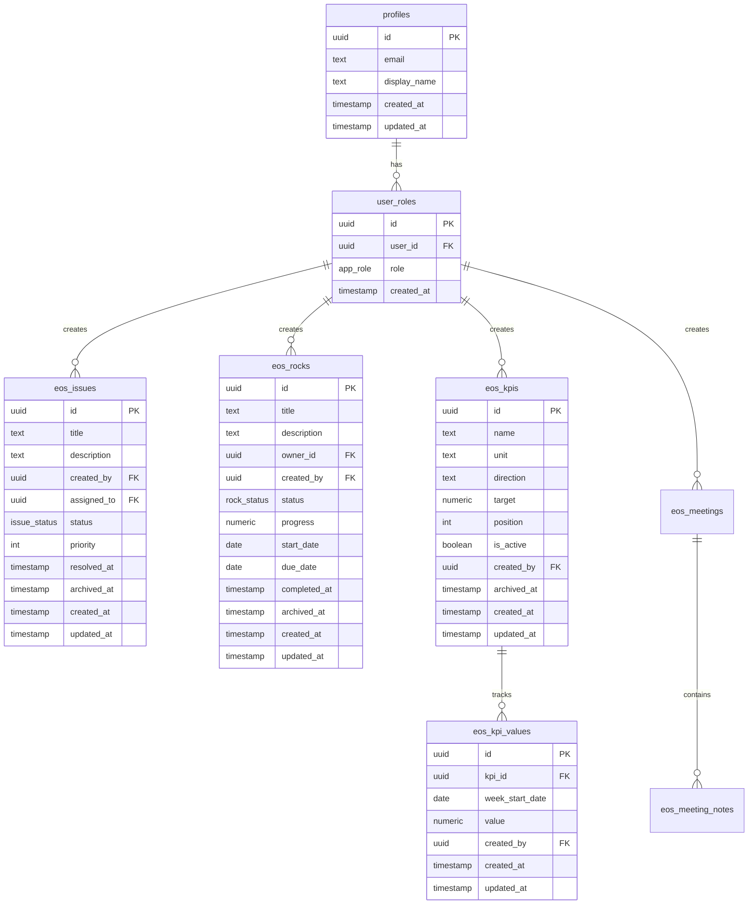
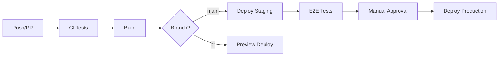

# EOS Application

A production-ready React application for managing EOS (Entrepreneurial Operating System) processes including rocks, issues, KPIs, meetings, and scorecards.

## 🚀 Quick Start

### Prerequisites
- Node.js 20+ 
- npm or yarn
- Supabase account

### One-Command Setup

```bash
# Clone the repository
git clone <repository-url>
cd eos-app

# Install dependencies
npm install

# Copy environment file and configure
cp .env.example .env.local

# Start development server
npm run dev
```

## 📋 Environment Variables

| Variable | Description | Required | Example |
|----------|-------------|----------|---------|
| `VITE_SUPABASE_URL` | Your Supabase project URL | ✅ | `https://xxx.supabase.co` |
| `VITE_SUPABASE_ANON_KEY` | Supabase anonymous key | ✅ | `eyJhbGciOiJIUzI1NiIsInR5cCI6IkpXVCJ9...` |
| `VITE_POSTHOG_KEY` | PostHog analytics key | ❌ | `phc_xxx` |
| `VITE_POSTHOG_HOST` | PostHog host URL | ❌ | `https://app.posthog.com` |
| `VITE_SENTRY_DSN` | Sentry error tracking DSN | ❌ | `https://xxx@sentry.io/xxx` |
| `VITE_APP_ENV` | Application environment | ❌ | `development` |
| `VITE_APP_VERSION` | Application version | ❌ | `1.0.0` |
| `VITE_APP_BASE_URL` | Base URL for the app | ❌ | `http://localhost:5173` |

## 🏗️ Architecture

### Tech Stack
- **Frontend**: React 18, TypeScript, Vite, Tailwind CSS
- **UI Components**: shadcn/ui, Radix UI
- **State Management**: Zustand, React Query
- **Backend**: Supabase (PostgreSQL + Auth + Realtime)
- **Analytics**: PostHog
- **Error Tracking**: Sentry
- **Testing**: Vitest, Testing Library, Playwright
- **CI/CD**: GitHub Actions
- **Deployment**: Vercel

### System Architecture



### Database Schema



## 🛠️ Development

### Available Scripts

```bash
# Development
npm run dev              # Start dev server
npm run build           # Build for production
npm run preview         # Preview production build

# Code Quality
npm run lint            # Run ESLint
npm run lint:fix        # Fix ESLint issues
npm run format          # Format with Prettier
npm run type-check      # TypeScript checking

# Testing
npm run test            # Run unit tests
npm run test:ui         # Run tests with UI
npm run test:coverage   # Run tests with coverage
npm run test:e2e        # Run E2E tests
npm run test:e2e:ui     # Run E2E tests with UI
```

### Code Style & Standards

- **TypeScript**: Strict mode enabled with additional checks
- **ESLint**: Configured for React and TypeScript
- **Prettier**: Consistent code formatting
- **Husky**: Pre-commit hooks for quality gates
- **Conventional Commits**: Standardized commit messages

### Testing Strategy

1. **Unit Tests** (Vitest + Testing Library)
   - Business logic functions
   - React hooks
   - Utility functions
   - Target: 85%+ coverage

2. **Component Tests** (Testing Library)
   - User interactions
   - Form validation
   - State management
   - Accessibility

3. **Integration Tests**
   - API integration
   - Database operations
   - Authentication flows

4. **E2E Tests** (Playwright)
   - Critical user journeys
   - Cross-browser testing
   - Mobile responsiveness

## 🔒 Security

### Authentication & Authorization
- Supabase Auth with email/password
- Row Level Security (RLS) policies
- Role-based access control (RBAC)
- Session management with auto-refresh

### Security Headers & Policies
- Content Security Policy (CSP)
- CORS configuration
- Input validation with Zod schemas
- XSS protection

### Data Protection
- GDPR compliant data handling
- Quebec Law 25 considerations
- Audit logging for all operations
- Data retention policies

## 📊 Observability

### Analytics (PostHog)
- User behavior tracking
- Feature usage analytics
- Conversion funnel analysis
- A/B testing capabilities

### Error Tracking (Sentry)
- Real-time error monitoring
- Performance monitoring
- Release tracking
- Source map upload

### Logging
- Structured logging with context
- Performance metrics
- User action tracking
- Environment-specific log levels

## 🚀 Deployment

### Environments

1. **Development** (localhost:5173)
   - Local development
   - Hot reloading
   - Debug tools enabled

2. **Staging** (staging.app.com)
   - Production-like environment
   - E2E testing
   - Feature previews

3. **Production** (app.com)
   - Live application
   - Performance monitoring
   - Error tracking

### CI/CD Pipeline



### Deployment Commands

```bash
# Deploy to staging (automatic on main push)
git push origin main

# Deploy to production (manual approval required)
gh workflow run "Deploy to Production" -f confirm=deploy
```

## 🎯 Performance

### Core Web Vitals Targets
- **LCP** (Largest Contentful Paint): < 2.5s
- **INP** (Interaction to Next Paint): < 200ms  
- **CLS** (Cumulative Layout Shift): < 0.1

### Optimization Strategies
- Route-based code splitting
- Image optimization
- Bundle analysis
- React Query caching
- Preconnect to external domains

## 🌐 Internationalization

### Supported Locales
- **fr-CA**: French (Canada) - Default
- **en**: English

### Implementation
- React Intl for message formatting
- Date/number localization
- RTL support ready
- Dynamic locale switching

## 📚 Documentation

- [Architecture](./docs/ARCHITECTURE.md)
- [Security](./docs/SECURITY.md) 
- [Observability](./docs/OBSERVABILITY.md)
- [Development](./docs/DEVELOPMENT.md)
- [API Documentation](./docs/API.md)

## 🆘 Support & Troubleshooting

### Common Issues

1. **Build Failures**
   ```bash
   # Clear node_modules and reinstall
   rm -rf node_modules package-lock.json
   npm install
   ```

2. **TypeScript Errors**
   ```bash
   # Run type check for detailed errors
   npm run type-check
   ```

3. **Test Failures**
   ```bash
   # Run tests in watch mode for debugging
   npm run test -- --watch
   ```

### Getting Help

- Check [GitHub Issues](../../issues)
- Review [Documentation](./docs/)
- Contact development team

## 📄 License

This project is proprietary and confidential.

---

**Built with ❤️ using modern web technologies**
