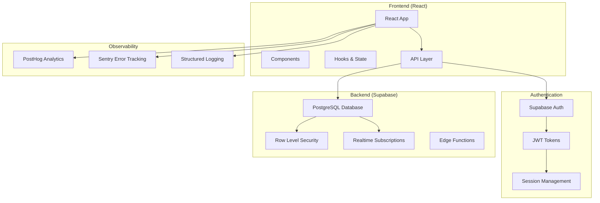
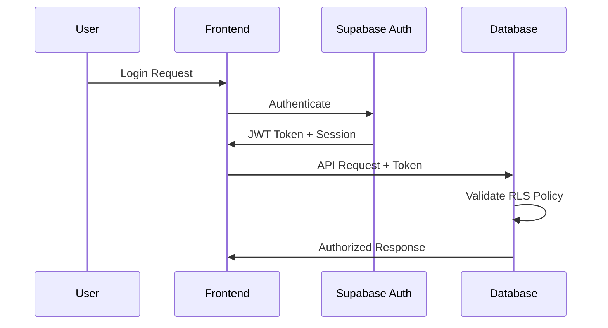
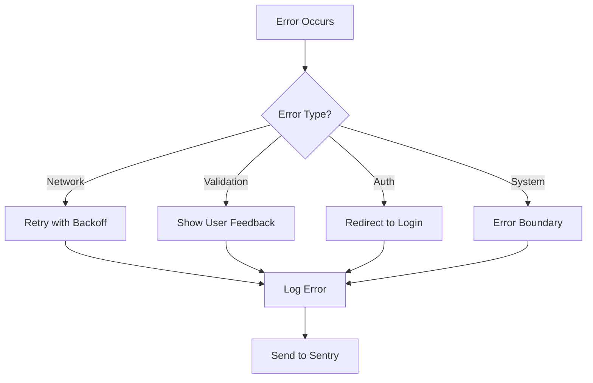

# Architecture Documentation

## System Overview

The EOS application is a modern, production-ready web application built with React and TypeScript, designed to manage Entrepreneurial Operating System processes. The architecture follows industry best practices for scalability, security, and maintainability.

## High-Level Architecture



## Component Architecture

### Frontend Structure

```
src/
├── components/           # Reusable UI components
│   ├── ui/              # Base UI components (shadcn/ui)
│   ├── auth/            # Authentication components
│   ├── eos/             # EOS-specific components
│   └── common/          # Common utility components
├── pages/               # Route-level components
├── hooks/               # Custom React hooks
├── lib/                 # Utility libraries
├── store/               # Zustand state management
├── contexts/            # React contexts
├── analytics/           # Analytics integration
└── config/              # Configuration files
```

### Key Architectural Patterns

1. **Compound Components**: Complex UI elements use compound component patterns
2. **Custom Hooks**: Business logic abstracted into reusable hooks
3. **Error Boundaries**: Graceful error handling at component boundaries
4. **Lazy Loading**: Route-based code splitting for optimal performance
5. **Provider Pattern**: Context providers for cross-cutting concerns

## Data Architecture

### Database Design Principles

1. **Normalization**: Proper table relationships with foreign keys
2. **Audit Trail**: All operations logged with timestamps and actors
3. **Soft Deletes**: Archive pattern instead of hard deletes
4. **Row Level Security**: User-based access control at database level

### Entity Relationships

The core entities follow EOS methodology:

- **Issues**: Problems to be solved (IDS - Issues, Discuss, Solve)
- **Rocks**: 90-day priorities with progress tracking
- **KPIs**: Key Performance Indicators with historical values
- **Meetings**: L10 meeting structure with agenda and notes
- **Todos**: Action items with assignments and due dates

## Security Architecture

### Authentication Flow



### Security Layers

1. **Transport Security**: HTTPS everywhere, secure headers
2. **Authentication**: JWT-based with automatic refresh
3. **Authorization**: Role-based access control (RBAC)
4. **Data Security**: Row Level Security policies
5. **Input Validation**: Zod schemas on client and server
6. **Output Encoding**: Automatic XSS protection

## State Management Strategy

### State Distribution

1. **Server State**: React Query for API data
2. **Global State**: Zustand for cross-component state
3. **Local State**: React useState for component-specific state
4. **Form State**: React Hook Form for form management
5. **URL State**: React Router for navigation state

### Caching Strategy

- **React Query**: 5-minute stale time, 10-minute garbage collection
- **Optimistic Updates**: Immediate UI feedback with rollback
- **Background Refresh**: Keep data fresh without blocking UI
- **Persisted State**: Auth state persisted to localStorage

## Performance Architecture

### Frontend Performance

1. **Code Splitting**: Route-based lazy loading
2. **Bundle Analysis**: Regular bundle size monitoring
3. **Image Optimization**: Responsive images with proper sizing
4. **Preloading**: Critical resources preloaded
5. **Caching**: Aggressive caching with proper invalidation

### Database Performance

1. **Indexing**: Proper indexes on frequently queried columns
2. **Query Optimization**: Efficient queries with minimal N+1 problems
3. **Connection Pooling**: Supabase handles connection management
4. **Realtime Optimization**: Replica identity for efficient updates

## Error Handling Architecture

### Error Categories

1. **Network Errors**: Retry with exponential backoff
2. **Validation Errors**: User-friendly form feedback
3. **Authentication Errors**: Redirect to login
4. **Authorization Errors**: Access denied messages
5. **System Errors**: Error boundaries with fallback UI

### Error Recovery



## Deployment Architecture

### Environment Strategy

- **Development**: Local with hot reloading
- **Staging**: Production-like for testing
- **Production**: Optimized build with monitoring

### CI/CD Pipeline

1. **Code Quality**: Linting, formatting, type checking
2. **Testing**: Unit, integration, and E2E tests
3. **Building**: Optimized production builds
4. **Deployment**: Automated with manual approval gates
5. **Monitoring**: Post-deployment health checks

## Scalability Considerations

### Frontend Scalability

- Component-based architecture for team scaling
- Micro-frontend ready architecture
- CDN-friendly static assets
- Progressive Web App capabilities

### Backend Scalability

- Supabase handles database scaling
- Edge functions for compute scaling
- Geographic distribution via CDN
- Horizontal scaling through load balancing

## Monitoring & Observability

### Metrics Collection

1. **Application Metrics**: Performance, errors, usage
2. **Business Metrics**: Feature adoption, user flows
3. **Infrastructure Metrics**: Server performance, database health
4. **Security Metrics**: Failed logins, suspicious activity

### Alerting Strategy

- **Critical**: Immediate paging for system down
- **Warning**: Email alerts for degraded performance
- **Info**: Dashboard notifications for trend changes

## Technology Decisions

### Frontend Technology Choices

| Technology | Rationale | Alternatives Considered |
|------------|-----------|------------------------|
| React 18 | Mature ecosystem, excellent TypeScript support | Vue, Svelte, Angular |
| TypeScript | Type safety, better DX, refactoring safety | JavaScript |
| Vite | Fast builds, excellent dev experience | Webpack, Parcel |
| Tailwind CSS | Utility-first, design system friendly | Styled Components, CSS Modules |
| React Query | Excellent server state management | SWR, Apollo Client |
| Zustand | Simple, lightweight global state | Redux, Context API |

### Backend Technology Choices

| Technology | Rationale | Alternatives Considered |
|------------|-----------|------------------------|
| Supabase | Full-stack platform, PostgreSQL, realtime | Firebase, AWS Amplify, Custom API |
| PostgreSQL | ACID compliance, excellent JSON support | MongoDB, MySQL |
| Row Level Security | Database-level security | Application-level authorization |
| Edge Functions | Serverless compute near users | Traditional servers |

## Future Considerations

### Planned Improvements

1. **Micro-frontends**: Break down into smaller, independent deployments
2. **Offline Support**: PWA with offline-first capabilities
3. **Real-time Collaboration**: Live editing and presence indicators
4. **Advanced Analytics**: Custom dashboards and reporting
5. **Mobile Apps**: Native iOS/Android applications

### Technical Debt Management

- Regular dependency updates
- Code review guidelines
- Architectural decision records (ADRs)
- Performance budget enforcement
- Security audit schedules
