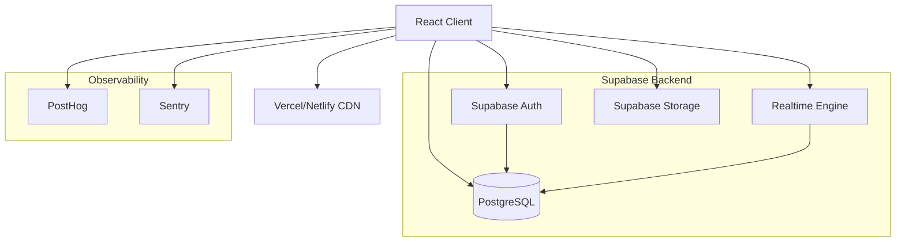
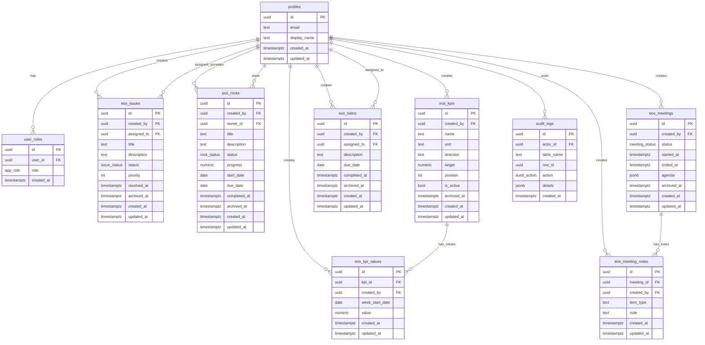

# Architecture Documentation

## System Architecture

## Entity Relationship Diagram

## Component Architecture

### Frontend Layer
- **React 18** with concurrent features
- **TypeScript** strict mode for type safety
- **Vite** for fast development and optimized builds
- **Tailwind CSS** with design system tokens
- **shadcn/ui** component library for consistency

### State Management
- **React Query** for server state and caching
- **Zustand** for minimal global client state
- **React Context** for authentication state
- **Local state** via useState/useReducer where appropriate

### Data Layer
- **Supabase Client** for database operations
- **Row Level Security** for authorization
- **Real-time subscriptions** for live updates
- **Optimistic updates** for better UX

### Security Architecture
- **Authentication**: Supabase Auth with JWT tokens
- **Authorization**: Row Level Security policies
- **Input Validation**: Zod schemas on client and server
- **CSP Headers**: Content Security Policy implementation
- **HTTPS**: Enforced in production

### Performance Architecture
- **Code Splitting**: Route-based lazy loading
- **Bundle Optimization**: Tree shaking and minification
- **Caching Strategy**: React Query with stale-while-revalidate
- **Image Optimization**: Responsive images with WebP
- **CDN**: Static assets served from edge locations

### Observability Architecture
- **Error Tracking**: Sentry with source maps and releases
- **Analytics**: PostHog for product insights and funnels
- **Logging**: Structured logs with correlation IDs
- **Monitoring**: Core Web Vitals and performance metrics
- **Tracing**: OpenTelemetry for distributed tracing
